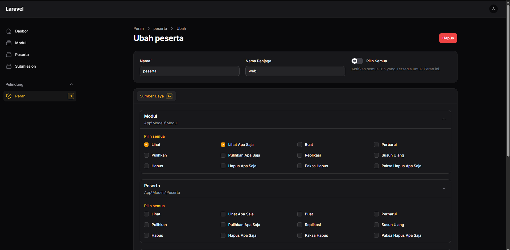
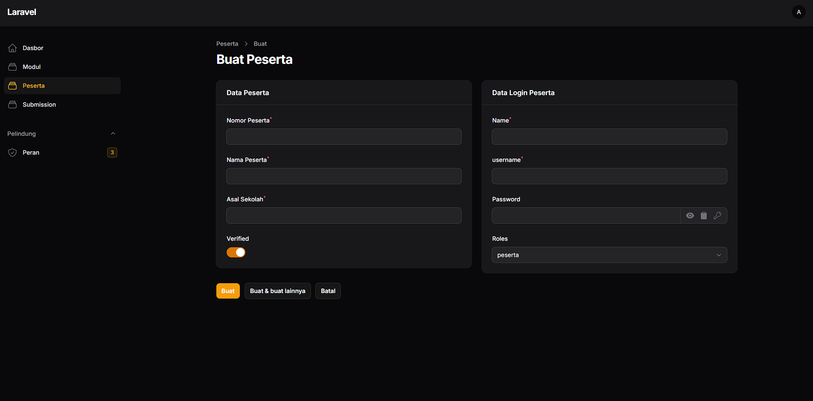

# LKS Submit

Website berbasis php untuk pengumpulan submission Lomba LKS sederhana. 


## Features

- Simple single admin user
- CRUD Peserta
- CRUD Modul dengan file resources
- Peserta Create Submission
- Saving Submission Histories
- Export file project peserta dengan format nama file seragam 


## Environment Variables

Sederhana, anda hanya perlu mengatur alamat database server pada file .env


## Requirements

- Composer (jika anda clone repo git)
- PHP 8.2 ^
- Mysql Server
- Cek requirement lain untuk menjalankan laravel 12 pada https://laravel.com/docs/12.x/deployment
- Nodejs & npm (opsional)
## Installation

Jika anda mendapatkan resource dari cloning repository, anda perlu melakukan Install dependency dengan composer dan npm

```bash
  composer Install
  npm Install
```

Siapkan .env file
```bash
  copy .env.example .env
  php artisan key:generate
```

Atur Symlink untuk file storage
```bash
  php artisan storage:link
```
    
Lakukan migrasi database
```bash
  php artisan migrate
```

Setup Filament Shield
```bash
  # buat user untuk admin
  php artisan shield:super-admin 

  # generate role untuk admin panel
  php artisan shield:generate --all
```

Jalankan project
```bash
  # sesuaikan port yang ingin digunakan
  php artisan serve --port 80
```

Anda juga dapat menjalankan project ini dengan web server lain seperti apache, nginx

Coba login pada http://localhost/admin/login dengan akun admin yang tadi dibuat


## Setelah Instalasi
Ada beberapa hal yang perlu anda atur setelah Instalasi

### Mengatur Role Peserta
- Login dengan admin user ke admin panel
- Buka menu Peran pada alamat http://localhost/admin/shield/roles
- Buat 1 Role untuk peserta
  
- Anda dapat mengatur peran peserta untuk setiap fitur dalam website, batasi agar peserta dapat melihat Modul & Detailnya serta Membuat Submission. Peserta seharusnya tidak bisa mengubah atau menghapus modul maupun submission yang telah dibuat. Submission dapat diunggah beberapa kali untuk mengubah submission yang sebelumnya (tercatat di history).

### Menambah Peserta
- Login dengan admin user ke admin panel
- Buka menu Peserta pada alamat http://localhost/admin/pesertas
- Buat peserta baru dengan data yang Ada
  
- Tulis nomor peserta sesuai pengambilan, maka field Name, Username, dan Password di sebelah kanan akan terisi otomatis untuk keseragaman format. 
- Password maksimal 8 karakter
- Tuliskan Nama Lengkap dan Asal sekolah Peserta
- Secara default peserta terverifikasi
- Pilih role yang sesuai dengan peserta untuk menentukan hak aksesnya
- Setelah peserta dibuat, maka peserta dapat login pada website dengan username dan password yang dibuat tadi.


### Menambah modul
- Login dengan admin user ke admin panel
- Buka menu Peserta pada alamat http://localhost/admin/moduls
- Buat Modul sesuai soal juri, masing-masing modul dapat disematkan file soal ataupun resource lain yang akan didistribusikan kepada peserta
- Setelah modul dibuat, peserta yang telah login dapat melihat detail dan file tambahan yang disematkan sebelumnya.
- Setiap modul harus diatur status "Submission Open" nya untuk menentukan apakah peserta dapat melakukan submission atau tidak pada modul tersebut


### Melihat Submission
- Setelah peserta melakukan Submission, maka akan tampil pada http://localhost/admin/submissions
- Anda dapat melakukan filter pada halaman ini untuk melihat submission pada modul tertentu
- Export Submission untuk memindahkan file project yang telah diunggah peserta ke folder "ready" dengan penamaan yang seragam agar mudah diidentifikasi. 
- File submission pada folder ready bisa dipindah untuk dilakukan pengecekan oleh juri
## Use Case Peserta

Peserta dapat menggunakan website untuk fitur-fitur berikut: 
- Melihat Modul yang ditambahkan admin
- Mengunduh file soal pada modul jika tersedia
- Membuat submission untuk setiap modul
- Submission dapat dilakukan berulang kali (overwrite) selama Modul diatur "Submission Open" oleh admin
- Melihat ukuran file project dan history dari submissionnya jika ada


## FIle hasil submission peserta

Setelah peserta melakukan submission, maka file akan tersimpan di __./storage/app/private/raw__ dengan nama file random. Berikutnya Admin dapat melakukan Export dari menu Submission untuk submission yang ingin dilakukan pengecekan. Anda dapat melakukan export satu per satu atau menandai submission lalu export dengan Bulk Operation.

Setelah dilakukan export maka file akan berpindah pada __./storage/app/private/ready/[nama-modul]/__ dengan namafile: __Project-peserta-[nomor].zip__